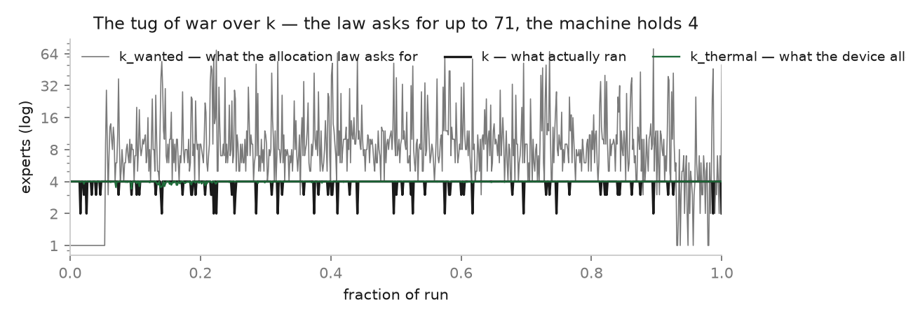
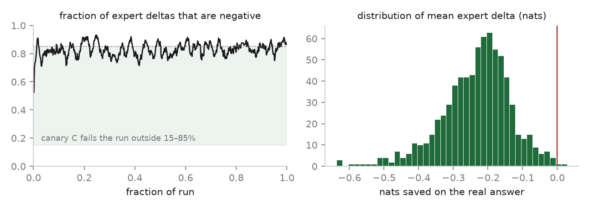
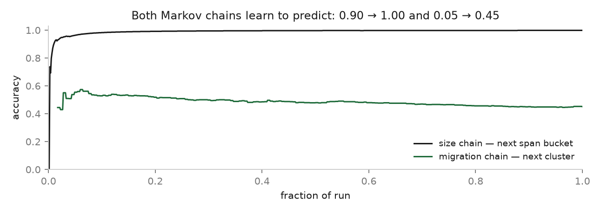
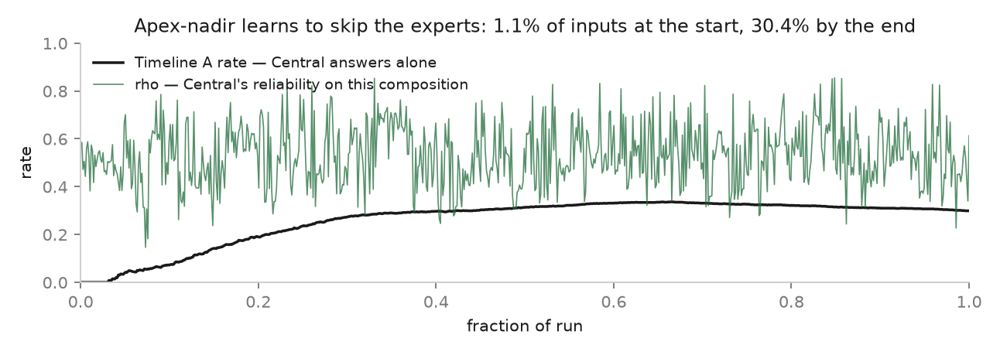
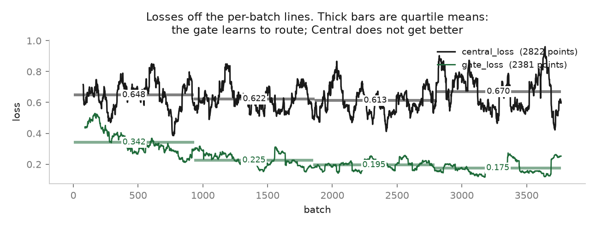
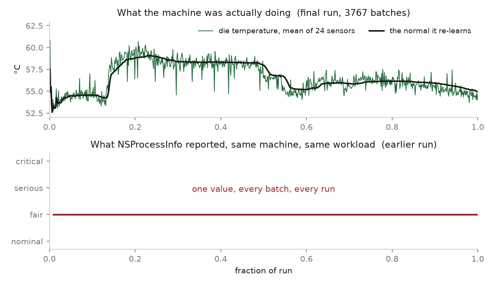
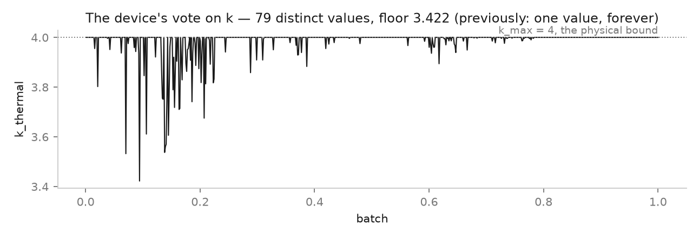
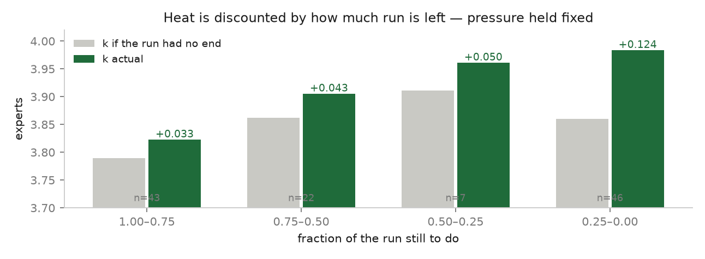

# Dum-E

**A self-supervising horizontal mixture-of-experts architecture for consumer
hardware.**

A Qwen2.5-0.5B gate routes over 100 Qwen2.5-1.5B LoRA experts into a Qwen3-4B
synthesiser. Reference implementation on an Apple M4 with 16 GB of unified
memory.

### Horizontal, not vertical

In a conventional MoE the experts are FFN sub-blocks *inside* one transformer's
layers, routed per token, all resident in one forward pass. Scale demands a
machine that can hold the whole network at once, and `k` — the number of experts
a token activates — is fixed at design time.

Dum-E is horizontal. An expert is a **whole model**, not a sub-block. It is
activated as a unit, reads its own fragment of the input rather than a token
stream, and writes a note in text. A separate synthesiser composes the notes.
Nothing routes inside a forward pass, so nothing requires the pool to be
co-resident: experts are paged from disk into unified memory in cycles, so the
pool is bounded by disk rather than by RAM.

That makes the memory ceiling a **scheduling problem instead of an architectural
one**, which is the property consumer hardware needs. Here the pool is nominally
~157B parameters against 16 GB of RAM. It fits because the 100 experts are LoRA
adapters over a single frozen 4-bit base — 35 MB each, not 1.5B weights each —
so the pool costs 3.5 GB of disk and one resident base, and because `k_max` is
fitted to the machine rather than chosen for it.

And `k` is not fixed. It is the system's primary observable: a tug of war between
what the input needs, what memory permits and what the silicon's temperature
allows, re-decided every batch. A correct run drives it *down* — when
apex-nadir predicts the experts buy nothing, `k` is zero and the synthesiser
answers alone. On the run below that reached 30.4% of inputs.

The architecture is the contribution. The rule it is built under is the other
one.

> **No quantity in this system is a number anyone chose.**

`k` comes from a RAM fit. The allocation law comes from a log-log regression
that refuses itself when the fit is inadmissible. Reward is a paired
cross-entropy delta against answers that came off disk, not cosine agreement
with the model's own hidden state. The span bound is a measured backward-pass
slope. Cluster count is `90 // floor(sqrt(90))`. Thermal regulation reads 24
real die sensors.

That rule is not aesthetic. The project's recurring failure mode — documented
across three audits — is **an ungrounded constant set to the value that closes
an adaptive loop**: a threshold below its own data's floor, an intercept pinned
to zero, a ratio of one curve to itself. Each one produced a system that ran
perfectly and learned nothing. This run exposed a new variant of the same bug,
described below.

---

## Contents

- [Horizontal, not vertical](#horizontal-not-vertical)
- [Specification](#specification)
- [How it works](#how-it-works)
- [The run](#the-run)
- [What the run actually shows](#what-the-run-actually-shows)
- [The sensor was a constant](#the-sensor-was-a-constant)
- [The regulator](#the-regulator)
- [What was removed](#what-was-removed)
- [What was fixed](#what-was-fixed)
- [Verify it](#verify-it)
- [Layout](#layout)
- [Known and deferred](#known-and-deferred)

---

## Specification

| | |
|---|---|
| Gate | Qwen2.5-0.5B-Instruct-4bit, d=896 |
| Experts | 100 × Qwen2.5-1.5B-Instruct-4bit, d=1536 |
| LoRA | r=8, α=16, dropout=0.05, over one frozen shared base |
| Central | Qwen3-4B-Instruct-2507-4bit, d=2560 |
| Hardware | Apple M4, 16 GB unified memory, MLX |
| Precision | 4-bit throughout |
| LR / grad clip | 2e-05 / 1.0 |
| Expert write | 32 tokens floor, 128 target ceiling |
| State version | 7 |

Every structural constant is derived, and here is each one's derivation:

```
k_tier       = floor(sqrt(RAM_GB))                        = 4
reserve      = sqrt(R/1024) * 1024                        = 4096 MB   (sqrt in GB)
usable       = R - reserve - central_mb - gate_mb          = 9860 MB
k_fit        = (usable - expert_peak) // slot_mb           measured, per machine
k_max        = min(k_fit, k_tier, MAX_CLUSTERS)            = 4
span_max     = (usable - expert_peak - k_max*slot)
               / update_slope_mb  - 2*TARGET_MAX_TOKENS    the transient bound
GENERAL_EXPERTS  = ceil(sqrt(100))                         = 10
CENTROID_EXPERTS = floor(sqrt(100 - 10))                   = 9
MAX_CLUSTERS     = 90 // 9                                 = 10
```

`slot_mb` and `update_slope_mb` are measured by probing the live process, not
declared. `reserve = sqrt(R)` in gigabytes is the same bracket `k_tier` uses, so
installing a sensor or changing the machine moves every bound together.

---

## How it works

### Geometry — formed offline, frozen

A cluster is a spherical cap `{x : v_k · x ≥ tau_k}`. Its area is monotone in
`tau_k` alone, so *resizing a cluster is one number* — and that number is the
only thing any online path may write. The centroid array is written exactly
once, by `form()`, and stamped with the version of the gate, extractor and
corpus that produced it. A different gate invalidates it and the loader says so
out loud rather than silently loading a stale geometry.

Each token's hidden state is assigned to the centroid it is closest to. That
assignment is the **token type**, and it is what the reliability vector is
indexed by.

### Routing — the gate splits before any expert exists

The gate reads the whole input and writes a bounded map of it. That map, plus a
position line, is the **orientation** an expert receives about the input it
cannot see. The input is then split into fragments, and each expert sees its own
fragment and the orientation — never the whole input, never another expert's
span.

The split happens **per fragment, not per expert**, and before activation, so an
expert that trained with a map and a position never meets a bare span in
production, and the split never depends on which experts happen to be resident.

### k — a tug of war, not a setting

```
k_len  = k_ram * min(1, span_max / T)     the system side: while the input fits
                                          in one pass, more experts buy coverage;
                                          past that each one is already reading a
                                          full pass and another buys nothing
k_dev  = min(k_ram, k_thermal)            the device side: heat and RAM are the
                                          same axis — both say what this machine
                                          will do right now
k_eff  = harmonic_mean(k_len, k_dev)      a soft minimum; the tightest constraint
                                          dominates smoothly
k      = min(round(k_eff), k_dev)         the device always has a hard veto,
                                          because a soft blend can land above the
                                          RAM bound and that is an OOM, not a
                                          preference
```



The allocation law's own answer, `k_wanted = T/ALLOC(T)`, is still computed and
still reported — it reaches 71 on long inputs — but it no longer drives `k`. It
runs the wrong way: it asks for the most experts exactly where each one is most
expensive. That is a measured rejection, not a stylistic one.

### The grounded reward — Central is the instrument, never the judge

```
b[t]   = CE_t(Central, q \n          | y)      baseline, one forward per batch
a_i[t] = CE_t(Central, q \n e_i \n   | y)      one forward per expert
d_i[t] = b[t] - a_i[t]                         nats saved on real token t
```

Everything that varies across experts is the presence of `e_i` in a prompt
scored against a **fixed `y` that came off disk**. Experts cannot move the
referent. Central appears in both `b` and `a_i`, so its systematic error cancels
to first order. The frame is identical in both passes and in pretraining, so the
paired difference is not confounded by a format change.

This replaced a reward of the form `(cos + 1) / 2`, which had a hard floor at
0.5 — measured minimum 0.511414 across 152 checkpoints and 994,231 tokens. **It
could not express "this expert hurt."** The current one can, and does:



Reliability `R[c]` is a vector over token types, fitted only on a held-out
shard, so it is never fitted on the tokens it grades. It is **measured, not
applied**: the delta is a plain mean over the target tokens. Weighting the delta
by `R` pushes the wrong way — where Central is reliable, `b[t]` is small, so
there is no headroom and `d[t]` is small anyway. The paired delta already
carries reliability. Multiplying by `R` on top of that downweighted exactly the
tokens with the most headroom, at a measured 1.7× against the natural effect.

### Apex-nadir — the allocation law is fitted, never set

```
probe schedule  t_lo = T mod n²,  t_mid = sqrt(T² - t_lo²)/2,  t_hi = T
                n = floor(sqrt(T)), decremented until n² < T
                a function of T alone: zero constants
envelopes       A = Q.9 (apex, overfit)   M = Q.5 (base)   N = Q.1 (nadir, underfit)
per expert      Q_e(t) = exp( M(t) + (u - 0.5)(A(t) - N(t)) )
                u is the expert's own overall rank in [0,1]
cost            c(t) = a + b·t, least squares over MEASURED latency.
                `a` is load-in overhead and is NEVER forced to zero — doing so
                makes g monotone decreasing and pins the argmax at t_lo
goldilocks      g_e(t) = Q_e(t)/c(t),  t*_e = argmax over [t_lo, t_hi]
law             log t* = log α + β log T   ⇒   ALLOC(T) = α·T^β
```

The single best idea in this repository is the **admissibility guard**. The fit
is rejected unless `0 < β ≤ 1` and the log-span is at least `e`. When it is
rejected, `predict()` returns `t` unchanged — the law declines to produce a
number it has not earned, and says so. An earlier version of this system had a
fit that failed that test, and because there was no guard it silently returned
a constant for every input.

### Standing and migration

```
S[e,k] = sum_delta / sum_tokens         nats saved per token the expert EMITTED
D[c]   = size[c] / sum(size)            domain rank, frozen at formation
r[e]   = Σ_c D[c] · S[e,c]              overall rank
```

A **pure rate**. No confidence term, no discount. Confidence lives in exactly
one place in this system — the Timeline A/B gate — and it is Central's
reliability that supplies it. A z-discount folded into `S` made every consumer
read a number that was part measurement and part uncertainty penalty, and at
n=1 the population variance is identically zero, so the discount vanished
exactly where it was needed most.

`sum_tokens` counts tokens the expert **emitted**, never the span the router
handed it. The span is the router's choice and must not move the expert's rank.

Domain rank cannot come from live traffic: `tau` breathes toward equal presence,
so presence rate is actively driven to uniform and carries no domain
information. Formation membership is the only honest source.

Two Markov chains run alongside — one predicting the next span-size bucket, one
predicting the next cluster — and both learn:



### Deployment — Timeline A, Timeline B, and dead time

At deployment there is no `y`, so there is no reward and nothing to fall back
on. The system decides whether experts are worth activating at all:

- **Timeline A** — apex-nadir predicts the allocation buys nothing on this
  input. Central answers alone, `k=0`, no expert is loaded, nothing is written.
- **Timeline B** — experts run, Central synthesises from their notes ordered by
  standing.
- **Dead time** — after A has served the user, B re-runs the same input *with*
  experts and scores each against the already-delivered text. That answer is out
  the door and cannot be moved, which makes it a legitimate frozen referent. It
  is the only thing that keeps experts improving on deployment traffic.



---

## The run

3,767 batches, **639,338 tokens**, ~10.5 hours, clean tree, exit 0. Commit
`089be50`, `logs/DIRTY` empty, so it is reproducible from a commit.

| | Previous baseline | This run |
|---|---|---|
| Tokens | 506,242 | 639,338 |
| Batches | 2,900 | 3,767 |
| Clone fraction (final) | 0.25 | **0.01** |
| Routing confidence ρ (final) | 0.326 | **0.613** |
| Standing observations | 7,001 | 9,129 |
| Reliability observations | 52,226 | 65,985 |
| Expert updates applied | 1,043 | 1,242 |
| Decisions | — | 2,381 admit / 945 heldout / 441 refuse |
| Thermal signal | 1.0, constant | 52.5–60.8 °C |
| `k_thermal` distinct values | effectively 1 | 79 |

Clone fraction is the one to read first. Experts are LoRA adapters over one
frozen base, so they begin **mathematically identical** — an untrained adapter
has `lora_b = 0`, an exact no-op — and can only diverge by training. At 0.25 a
quarter of batches had two experts emitting identical text. At 0.01 the pool has
genuinely differentiated.



Read off the per-batch log lines, not the health record. The health record
carried conditional fields forward (see [What was fixed](#what-was-fixed)), so
its loss curves plotted smoother than the run actually was.

Quartile means over the run, which is the honest statistic here — first-ten and
last-ten figures are distorted by the cold-start transient and by a heavy right
skew (central_loss has mean 0.63 against median 0.42):

```
gate_loss      0.342 -> 0.225 -> 0.195 -> 0.175     n=2381   a real 49% decline
central_loss   0.648 -> 0.622 -> 0.613 -> 0.670     n=2822   flat, and up at the end
```

**The gate learns to route. Central does not get better.**

---

## What the run actually shows

Two findings, and the second is not flattering.

**The mechanisms fire.** All of them. `did_it_fire.py` reports 753 health
records, 0 problems, all six input→output chains live. The device voted on `k`
for the first time in the project's history. The reward is signed and keeps its
spread. Both Markov chains predict. The gate's loss falls. Experts diverged 25×.

**The experts mostly are not helping yet.** The mean expert delta is negative
across nearly the whole distribution: the average note *raises* Central's
cross-entropy on the real answer rather than lowering it. `delta_neg_frac` sits
around 0.85, which is the top edge of the canary band that fails the run outside
15–85%.

**Three independent measurements agree**, through three different code paths:

1. the reward says the average expert note raises Central's CE;
2. apex-nadir learned to route **30.4% of inputs around the experts entirely**,
   up from 1.1% at the start — the A/B gate discovering the same fact;
3. `central_loss` does not fall (0.648 → 0.622 → 0.613 → 0.670 by quartile)
   while `gate_loss` does (0.342 → 0.175). Routing improves; the answers do not.

Three mechanisms that do not share code reaching the same conclusion is a
stronger result than any of them alone, and it is the kind of agreement the
previous versions of this system were structurally incapable of producing —
their reward had a hard floor at 0.5 and could not say "worse" at all.

This is consistent with the budget. 3,767 batches at k≈4 is ~15,000
expert-selections over 100 experts: **about 151 each**. This run is a mechanism
test, not a capability run, and it should be read as one. What it establishes is
that every loop is closed and every signal is live — which is precisely what the
previous three versions of this system could not establish.

The honest headline is: *the instrumentation now works well enough to tell us
the experts do not.*

---

## The sensor was a constant

The thermal regulator was correct in every line, logged clean records for
thousands of batches, passed every assertion in the harness, and never once
moved `k`.

`NSProcessInfo.thermalState()` returned `fair` on all 580 samples of a
2,900-batch run, all 541 of the next, and on every direct poll under sustained
load. Its baseline converged to the one value it ever saw, its volatility sat at
0.000, its step intervals were never set because no step ever happened, and
`k_thermal` went 2.758 → 4.000 and stayed. The device had never cast a vote.

The silicon was never constant.



`models.die_temp()` reads 24 SoC die sensors through IOKit's HID event system —
match on usage page 0xff00 / usage 5, then `kIOHIDEventTypeTemperature`. No
sudo, no subprocess, no new package; pure ctypes against the IOKit framework.
16 ms for all 24 sensors, 0.03% of a batch.

The **mean** of the sensors, not the max. Over a 60 s trace while training,
max(tdie) had σ=1.29 °C and 4.08 °C of range against mean(tdie)'s 0.36 and 1.13.
The max is a per-core spike detector and at one read per batch it samples noise.
Battery temperature is also sudo-free and was rejected on measurement — 31.19 →
31.20 °C over five minutes at full load, far too damped to see the work.



---

## The regulator

```
span     = peak - floor                    the range this die actually works over
z        = (T - mean) / span               how far above its own normal it sits now
pressure = max(0, z - mean|z|)             less the jitter it shows while idle
k        = k_max ** (1 / (1 + pressure * left))
                                           unless the OS reports `serious`, then k = 1
mean    += min(1, run/n) * (T - mean)      the normal re-learns
```

Four moving parts, and each is there for a measured reason.

**The scale is the span, not the noise floor.** Taken in the 0.33 °C mean
absolute deviation, a 3 °C rise scores 8.7σ, pressure 26.6, and collapses `k` to
1.05 — on a die that idles at 45 and works at 67. The span is the range the
machine has actually been measured over, so pressure reaches 1 when the
excursion is the size of the whole working range.

**The deadband is the machine's own mean |z|,** so idling costs nothing, and it
cannot lock itself shut: `z` beats its own mean absolute value whenever the
excursion is above average — P(Z > 0.798σ) ≈ 21% for anything bell-shaped,
independent of the machine's scale or noise. Simulated at full run length it
settles at 0.031 and fires on 21.3% of reads.

**The normal re-learns,** weighted by how long the temperature has held the same
side of it. A transient flips sides, resets `run` to 1, and moves the mean by
1/n. A genuine shift holds one side and becomes the new normal. Nothing is
tuned: the horizon is the history it has to outweigh. This exists because the
room is not stationary — an earlier version was pinned to a normal that no
longer existed after the room went 20 °C → 34 °C mid-session.

**`left` multiplies the heat rather than adding to it.** Heat is a forecast —
*this machine will be in trouble if it keeps working like this* — and how much
that matters depends entirely on how much working is left. A die climbing over
the last hundred batches has nowhere to get to before the run ends.



Pressure is logged *before* scaling, so holding it fixed separates the scaling
from the regulator settling. Same heat late in the run keeps four times as many
experts as early.

Multiplying also settled what adding could not. A pressure in span-fractions and
a time in seconds have no common unit, and every attempt to find one either
cancelled — `seconds_left` is itself built from `k`, so the ratio collapses to
`1/k` — or pinned `k` at 1 for most of a long run. A multiplier needs no common
unit, and `left = 1` when no horizon is declared, which is the full heat
response: the safe direction to be wrong in.

**The OS keeps a veto underneath,** at `serious`. That is Apple's number, not
ours, and by then the OS is already throttling, so adding experts worsens
exactly what it is complaining about. It is absolute — scaling cannot reach it,
even at `left = 0`.

---

## What was removed

Every deletion was made because a measurement said the thing was not working,
not because it looked complicated.

| Removed | The number behind it |
|---|---|
| The ordinal apparatus: baseline, volatility, step intervals, `excess`, the k ramp, the learned threshold | All of it existed to squeeze a rate out of a four-valued ordinal with no usable pointwise derivative. Every one was identically zero or frozen for all 2,900 batches. |
| Explicit 1st and 2nd derivatives of temperature | Built, measured, cut. On the raw reading they are noise — a *settled* machine spiked to pressure 2.06 while a real +3 °C step scored less than idle. On the mean they vanish. Audit: `z` carried 97–99% of the signal, the first derivative 0.8–1.9%, the second 0.4–0.7%. |
| The `k_time` term | `tau / (a + b·alloc(T))`, with `tau` the mean of the same latency bank `(a,b)` was fitted to. One curve divided by itself. Measured 1.08–1.14 across T=64..2048, unmoved by machine speed, and it pinned `k` at 2 for all 1,566 batches. |
| The `R`-weighted delta | Downweighted exactly the tokens with the most headroom, at a measured 1.7× against the natural effect. |
| A z-discount inside standing | At n=1 the population variance is identically zero, so it vanished exactly where it was needed. |
| A second-order `k` with its own velocity and two thresholds | Built across four commits, then reverted whole. Parked on branch `thermal-second-order`; nothing deleted. |

The derivatives were **redundant, not weak**. `z` is already the rate term:
because the mean lags, a die that has just reached 60 °C scores z=+0.504 and one
that has been at 60 °C for 400 reads scores 0.000. A fast reading against a
slowly re-learning normal is a high-pass filter whose time constant is the
machine's own history. The second-order behaviour lives in the gap between the
two, not in a difference taken on either.

---

## What was fixed

| Problem | Measurement | Fix |
|---|---|---|
| The thermal sensor was a constant | `fair` on 100% of samples across three runs and every direct poll | Die temperature via IOKit; the ordinal kept only as a veto at `serious` |
| `k_thermal` read twice per batch | Every interval measured in half-batches; the health record logged a different `k` than the router used | The property caches into `last_k_thermal`; reporting reads the cache |
| The health record was never cleared | `graded` repeated on 100% of records, `imitate_loss` 44%, `expert_loss` 16%, `alloc_width_var` 95% | Cleared after each emit; absent beats stale |
| `graded` could not report a refusal | Assigned only on the admit path. The batch lines show **441 refusals (11.7%)** the record showed none of | Written unconditionally, 0.0 by default |
| `imitate_loss` had no honest source | Recorded only into the stale record, so 44% of its points were carried forward | Printed per batch with the others; a check asserts every recorded loss reaches the batch line |
| A guard whose fixture proved nothing | A smooth `linspace` warmup leaves the deadband at **0.0000**; the mutation the guard was written for passed every check | Fixture jumps and holds, as the real die does; the guard asserts on its own fixture first |
| The run horizon reached Python by inheritance | A bare supervisor invocation would silently make `left` 1.0 for the whole run | Exported; an undeclared horizon gives the full heat response |

Five of those seven are the same bug wearing different clothes: **something that
runs perfectly and reports nothing.** A sensor that never moves. A record that
reports history in the present tense. A field that cannot express its own
negative case. A curve with no honest source. A test fixture that never
exercises what it tests.

None is a crash. None produces a wrong number that looks wrong. None is findable
by reading the code — every one was found by asking a log whether a value had
ever changed.

The sixth happened *while fixing* the first, in the same file, on the same day.
That is the argument for `did_it_fire.py` existing as permanent tooling rather
than as a one-off diagnosis.

One fix had its argument already written in the same function. The comment above
the alarm filter reads: *"a condition that cleared kept printing forever … a
record whose job is to say whether a mechanism is doing anything must not report
history in the present tense."* It had been applied to `self.alarms` and not to
`self.rec`, four lines away — the same shape as an earlier bug where
`_fit_cost` fitted a latency intercept and `update_latency`, in the same file,
did not.

---

## Verify it

```
python -m dume.main form     --samples 200     # offline geometry, once
python -m dume.main pretrain --tokens 20000    # Central alone, plain CE
python -m dume.main train    --batches 50      # the grounded joint loop
python -m dume.main run      --prompt "..."    # deployment; writes no reward

python scripts/dume_check.py                   # assertions, model-free, seconds
python scripts/did_it_fire.py                  # did each mechanism ever move?
python scripts/build_figures.py                # the figures above, from the logs
```

**`dume_check.py`** is an assertion harness over every mechanism, and it is
mutation-tested: each thermal assertion was confirmed to fire when its mechanism
is deliberately reverted. Mutations checked — removing the jitter deadband,
scaling by the noise floor instead of the span, dropping the OS veto, freezing
the mean at 1/n, removing the floor at zero, restoring the double read, making
`left` add instead of scale, ignoring it, unclamping it, freezing the deadband
after warmup, moving `graded` back to the admit path, and removing a loss from
the batch line. Each fails a different, named assertion.

**`did_it_fire.py`** reads a run's health records and asks, per field, whether
the number ever changed. Two things make it more than a diff.

*The tail.* Movement alone is not the test. In the run that hid the thermal bug
`k_thermal` **did** move — 2.758 → 4.000 during warmup as its baseline converged
onto the one level it would ever see — and then never again for 2,900 batches. A
mechanism that settles once and flatlines is inert however lively it looked
getting there, so every field is judged on the last half of the run as well as
the whole of it.

*The chain.* A constant output is not by itself a bug; a cool machine should
produce no thermal pressure. It is a bug when the output is constant while its
**input** moved. When the input is dead too, the fault is upstream at the
sensor — and it says so. Pointed at the archived logs of the run that hid the
bug, it prints the whole diagnosis:

```
thermal        108   1   1.0000   1.0000   CONSTANT
thermal_gap_up 108   1   7.0000   7.0000   CONSTANT
thermal_excess 108   1   0.0000   0.0000   CONSTANT
k_thermal      108   2   3.3040   4.0000   WARMUP ONLY
thermal_p -> k_thermal   input dead too -- look UPSTREAM of thermal_p
```

On the final run: **753 records, 0 problems, all six chains ok.** Three fields
are still constant, each correctly so — `thermal_floor` and `thermal_peak` are
running extremes, so constant means the die never left its established range;
`thermal_level` is the OS ordinal, still pinned at `fair` for all 639,338
tokens, the original diagnosis holding true live while the die beside it swings
8 °C and moves `k`.

---

## Layout

```
dume/
  chain.py       thermal regulator, migration and size Markov chains
  models.py      gate, expert pool, central, die_temp()
  scheduler.py   RAM fit, k_max, span_max, residency
  alloc.py       apex-nadir: probes, envelopes, cost model, the allocation law
  router.py      planning, fragment splitting, k_effective
  geometry.py    offline cluster formation; tau breathes, directions do not
  reward.py      paired-CE deltas, reliability vector, admission band
  standing.py    expert standing, migration, the general class
  curriculum.py  what the run is shown and when
  train.py       form / pretrain / train / answer / dead_time
  health.py      the record, the canaries, the alarms
scripts/
  dume_check.py      model-free assertions, mutation-tested
  did_it_fire.py     dead-mechanism detector
  build_figures.py   the figures above, drawn from the run's own logs
  build_report.py    the long-form PDF report
  fresh_run.sh       archive, re-form, launch — nothing is deleted
  run_to_500k.sh     sequential supervisor; two model processes will not fit
analysis/
  run_*/             archived summaries, health and batch records per run
  dume-run-report.pdf
docs/
  design-rules.md, rewrite-map.md, grounded-reward.md, diagnosis.md …
  figures/           the images in this file
  paper-original-2026-06.md    the superseded paper, kept as the record
```

---

## Known and deferred

**Expert-pass amortisation.** A pass costs `a = 0.542 s` fixed plus
`b = 0.00507 s/token`, and experts write 8–29 tokens, so **~84% of a pass is
fixed cost**. Irrelevant to training — four passes are 17% of a batch, which is
dominated by the backward passes — and material to deployment, where the answer
path has no backward pass and the sequential expert loop sits entirely in front
of the first token. Before any fix: split that 0.542 s into park /
`load_weights` / prefill. Those are three different problems with three
different fixes, and guessing which would repeat the mistake of optimising the
part that was not the cost.

**`imitate_loss` for this run.** 44% carried forward. 425 genuine measurements
survive and the curve is recoverable in shape — and that shape is flat, 2.356 →
2.166 across the whole run. What is lost is the firing rate, which is a count
and does not need 639k tokens to measure.

**Per-expert budget.** ~151 selections per expert. Whether expert identity earns
anything at that budget is the open question, and the negative deltas above
suggest the honest answer is *not yet*.

**`MIGRATE_EVERY = 20`** suspected thrashing, unexamined.

**A `state.VERSION` bump** silently discards clock, batch and consumed.

**Expert system prompt** still says "give the single key insight another model
should use to answer", with no referent now that the input is gone.
